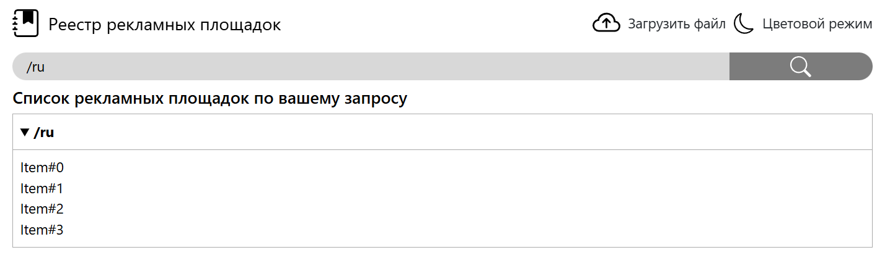
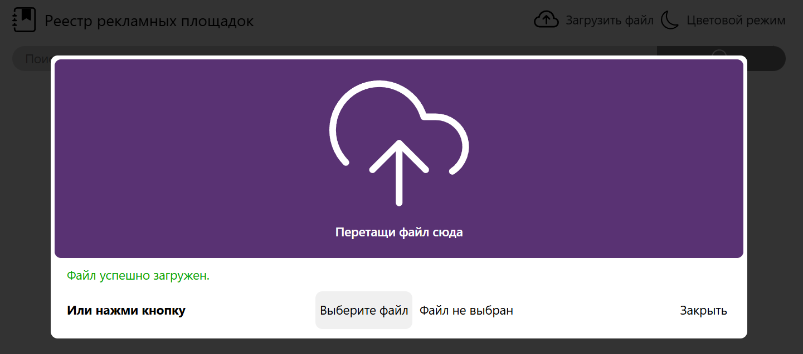

# Тестовая задача (Рекламные площадки)
**C# ASP.NET Core web application**  

**Содержание**  
1. [Задача](#task)
   - [Что нужно сделать](#what_needs)
2. [Решение](#solution)
   - [Математическая модель](#math_model)
   - [Параметры приложения](#app_param)
   - [Результат](#result)
   - [Использованные технологии](#tech_used)
3. [Запуск проекта](#project_launch)

## <a id="task">Задача</a>
Рекламодатели часто хотят размещать рекламу в каком-то конкретном регионе 
(локации), например только в московской области или только в городе Малые Васюки.  

Мы хотим сделать сервис, который помог бы подбирать рекламные площадки для 
конкретного региона.  

Все рекламные площадки перечислены в текстовом файле вместе с локациями, в 
которых они действуют.  

> [!IMPORTANT]
><ins>**Пример файла:**</ins>   
**Яндекс.Директ: /ru**  
**Ревдинский рабочий: /ru/svrd/revda, /ru/svrd/pervik**  
**Газета уральских москвичей: /ru/msk, /ru/permobl, /ru/chelobl**  
**Крутая реклама: /ru/svrd**  

Здесь **Ревдинский рабочий** - это рекламная площадка, a **/ru/svrd/revda** и **/ru/svrd/pervik** — локации, в которых действует **Ревдинский рабочий**  

Локации вложены, если одна содержит другую как префикс, например **/ru/svrd/ekb** вложена в **/ru/svrd, /ru/svrd** вложена в **/ru, /ru/svrd/ekb** вложена в **/ru**.  

Рекламная площадка действует во всех указанных локациях перечисленных через “,”. Чем меньше вложенность локации, тем глобальнее действует рекламная площадка.  

Пример: для локации **/ru/msk** подходят **Газета уральских москвичей** и **Яндекс.Директ**. Для локации **/ru/svrd** подходят **Яндекс.Директ** и **Крутая реклама**, для **/ru/svrd/revda** подходят **Яндекс.Директ**,  **Ревдинский рабочий** и **Крутая реклама**, а для локации **/ru**
подходит только **Яндекс.Директ**. 
 
### <a id="what_needs">Что нужно сделать</a>:
Необходимо реализовать простой веб сервис, позволяющий хранить и возвращать 
списки рекламных площадок для заданной локации в запросе.  

<ins>Информация для реализации:</ins>
- Веб сервис должен содержать 2 метода REST API:
  1. Метод загрузки рекламных площадок из файла (должен полностью 
перезаписывать всю хранимую информацию). 
  2. Метод поиска списка рекламных площадок для заданной локации. 
- Данные должны храниться строго в оперативной памяти (in-memory collection). 
- Важно получать результат поиска рекламных площадок как можно быстрее. 
- Считаем, что операция загрузки файла вызывается очень редко, а операция 
поиска рекламных площадок очень часто. 
- Программа не должна ломаться от некорректных входных данных.
- Выполнить на языке С#  

## <a id="solution">Решение</a>  
### <a id="math_model">Математическая модель</a>  
В основе хранения данных, лежит **Dictionary<location, AdvertisingPlatforms>** - это поволяет нам получать значения по ключу(***Location***) со сложностью O(1). Для предотвращения избыточноти повторения данных, в объекте(***AdvertisingPlatforms***) присутствует ссылка на предшествующий элемент, для каскадного получения данных (***Например:*** объект по ключу **/ru/msk** хранит ссылку на объект по ключу **/ru**).

### <a id="app_param">Параметры приложения</a>
При разработке были реализованы стартовые настройки приложения в файле **appsettings.json**, влияющие на его работу. Настройки расположены в json-блоке **ApplicationSettings** со следующими параметрами:

1. Параметры валидации загрузочного файла (указывать строго тип и контент файла). Json-блок **FileValidationParameters**:  
   - ***AllowedExtensions***: списко допустимых расширений файла. Если список пуст, то допустимы все расширения файла.  
   По умолчанию: **[ ".txt" ]**;
   - ***AllowedMimeTypes***: список допустимых MIME типов файла. Если список пуст, то допустимы все MIME типы.  
   По умолчанию: **[ "text/plain" ]**;
   - ***MaxSize***: максимальный размер файла.  
   По умолчанию: **52428800** байт (*50Мб*).

2. Параметры валидации данных рекламных площадок.  
Json-блок **AdvertisingPlatformValidationParameters**:  
   - ***CapitaLetterSensitivity***: параметр чувствительности к символам верхнего регистра.  
   Если параметр равен **true**, то следующие локации разные: **/ru, /Ru, /rU, /RU**.  
   По умолчанию: **false**;  

   - ***AllowingTheUseOfCapitalLetters***: разрешение на использование символов верхнего регистра.  
   Если параметр равен **true** и ***CapitaLetterSensitivity*** = **false**, то следующие локации одинаковые: **/ru, /Ru, /rU, /RU**.  
   Если параметр равен **false** и ***CapitaLetterSensitivity*** = **false**, то файл с локациями в верхнем регистром не валиден: **/Ru, /rU, /RU** -> ошибки.  
   По умолчанию: **false**;

   - ***LocationsWithTheSameName***: разрешение на использование локаций с одинаковыми названиями.  
   Если параметр **true**, то могут существовать одновременно локации типа: **/ru/fp, /kz/.../fp** -> валидны.  
   Иначе говоря, нельзя однозначно определить локацию по последней подлокации: **/fp** ---(вернёт)--> **/ru/fp** и **/kz/.../fp**;  

   - ***RepeatingSubLocations***: разрешение на использование одинаковых подлокаций в полной локации.  
   Если параметр равен **true** и ***LocationsWithTheSameName*** = **true**, то следующие локации типа: **/ru/ru, /ru/.../ru** -> валидны.  
   Если параметр равен **false** и ***LocationsWithTheSameName*** = **true**, то следующие локации типа: **/ru/ru, /ru/.../ru** -> ошибки.  
   По умолчанию: **false**.

### <a id="result">Результат</a>

Рисунок 1 - Окно поиска рекалмных площадок по заданной локации

Рисунок 2 - Диалоговое окно загрузки фала

### <a id="tech_used">Использованные технологии</a>

**Frontend**: *front-end stack* (HTML, CSS and JavaScript), *Bootstrap v5.0*, *Jquery*, *SCSS*  
**Backend**: *ASP NET Core*, *Docker*  
**Tests**: *xUnit* (Unit and integration testing)

## <a id="project_launch">Запуск проекта</a>  
Для локального запуска проекта в системе(windows) требуется наличие **Docker** или **dotnet**.  
Порядок действий:  
1. Скачать в любое место данный репозиторий. Можно при помощи команды:  
git clone https://github.com/RyuuKun-00/Advertising_Platforms.git
2. После загрузки в папке ./Advertising_Platforms запустить исполняемый файл **launch_in_Docker.bat** для поднятия проекта в Docker(Docker должен быть запущен) или запустить **Local_launch.bat** он запустит проект локально.  
3. После поднятия контейнера откроется ссылка в браузере с проектом по адресу: http://localhost:5000

